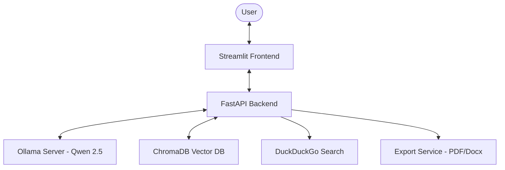
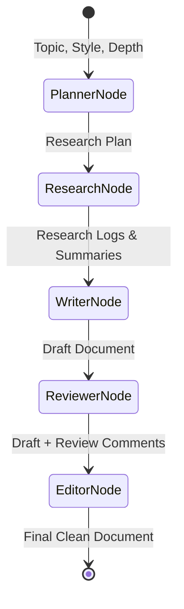
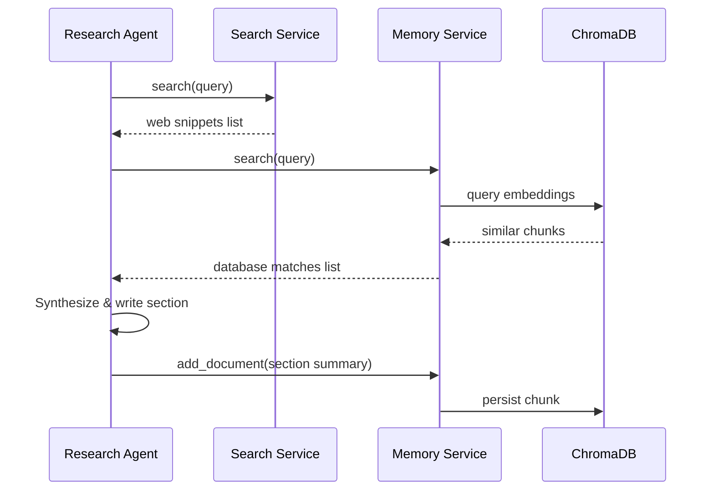

# System Architecture

This document provides a detailed overview of the system architecture, component relationships, data flow, and pipeline execution for the AI Multi-Agent Research Writer.

---

## Overall Architecture

The application is structured as a decoupled client-server system consisting of a Streamlit frontend and a FastAPI backend. The backend communicates with a local Ollama instance for LLM inference and ChromaDB for persistent vector storage.

---

## Backend Flow

The backend is built with FastAPI and runs asynchronously.

1. **Startup Validation**: When the server launches, [run_startup_checks](file:///C:/Users/Shivangi/Desktop/Multi-Agent%20Research%20writer/backend/core/startup_validation.py) is triggered via the FastAPI lifespan context manager. It verifies:
   - System temporary directory writability.
   - ChromaDB folder creation and write permissions.
   - Connection status and model availability on the Ollama server.
2. **API Router**: The main API endpoint resides in [routes.py](file:///C:/Users/Shivangi/Desktop/Multi-Agent%20Research%20writer/backend/api/routes.py). It exposes:
   - `GET /health` for component diagnostics.
   - `POST /research` to trigger the multi-agent workflow.
3. **Lifespan and Singletons**: Singletons like `ai_service` and the global `workflow` are initialized at startup, conserving system memory and avoiding redundant network connections.

---

## Frontend Flow

The frontend is implemented using Streamlit in [app.py](file:///C:/Users/Shivangi/Desktop/Multi-Agent%20Research%20writer/frontend/app.py).

1. **User Interface**: Provides inputs for the Research Topic, Style Guide, and Depth.
2. **REST API Requests**: Submits requests asynchronously to the backend `/research` endpoint.
3. **Session State Management**: Manages real-time logs, status spinners, and temporary file download links for generated reports.
4. **Document Downloader**: Allows downloading final files in PDF and Word format using export handlers.

---

## LangGraph Execution Pipeline

The core orchestration is managed by LangGraph in [research_workflow.py](file:///C:/Users/Shivangi/Desktop/Multi-Agent%20Research%20writer/backend/workflows/research_workflow.py). It uses a structured state graph to transition through specialized agent nodes sequentially:

### Agent Roles
* **[PlannerAgent](file:///C:/Users/Shivangi/Desktop/Multi-Agent%20Research%20writer/backend/agents/planner_agent.py)**: Structures research tasks into key outline sections.
* **[ResearchAgent](file:///C:/Users/Shivangi/Desktop/Multi-Agent%20Research%20writer/backend/agents/research_agent.py)**: Spawns search and memory retrievals.
* **[WriterAgent](file:///C:/Users/Shivangi/Desktop/Multi-Agent%20Research%20writer/backend/agents/writer_agent.py)**: Generates detailed Markdown content for each section.
* **[ReviewerAgent](file:///C:/Users/Shivangi/Desktop/Multi-Agent%20Research%20writer/backend/agents/reviewer_agent.py)**: Reviews draft content for grammar, tone, and logical consistency.
* **[EditorAgent](file:///C:/Users/Shivangi/Desktop/Multi-Agent%20Research%20writer/backend/agents/editor_agent.py)**: Refines the final document based on reviewer feedback.

---

## Search + RAG Flow

The system employs Retrieval-Augmented Generation (RAG) to ensure factual accuracy and consistency across long-form reports:

* **[SearchService](file:///C:/Users/Shivangi/Desktop/Multi-Agent%20Research%20writer/backend/search/search_service.py)**: Utilizes DuckDuckGo Search API to retrieve top-5 live snippets.
* **[MemoryService](file:///C:/Users/Shivangi/Desktop/Multi-Agent%20Research%20writer/backend/memory/memory_service.py)**: Integrates persistent ChromaDB storage to load and store research summaries. This prevents hallucination by matching sections against previously retrieved/summarized knowledge.

---

## Export Flow

Once the graph completes, the final Markdown report is sent to the document compilation pipeline:

1. **Streamlit Trigger**: The frontend receives the final Markdown string and sends it to `ExportService` inside [export_service.py](file:///C:/Users/Shivangi/Desktop/Multi-Agent%20Research%20writer/backend/utils/export_service.py).
2. **PDF Generation**: Utilizes `ReportLab` to compile a formatted, styled PDF document including:
   - Dynamic page numbering (Page X of Y).
   - Style tags, headers, and paragraph wrappers.
   - Clean tables for references.
3. **Word DOCX Generation**: Utilizes `python-docx` to construct formatted tables, structured headers, list items, and standard styles.
4. **Temporary Storage**: Saves documents to the system's temporary directory before delivery to clean up memory footprints on complete downloads.
